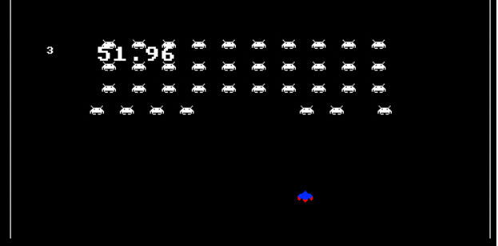

# SpaceInvader with Kaboom.js

In order to get acquainted with the kaboom.js library I coded a space invader game following the awesome tutorial from freeCodeCamp.org

## Setup

The project was coded entirely using the replit environment and it might not work immediately on a local machine

